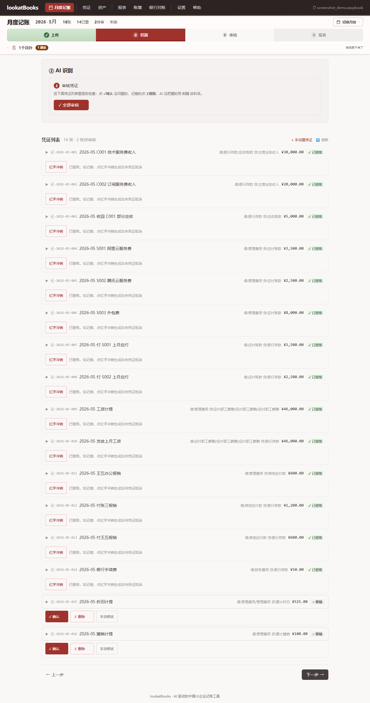
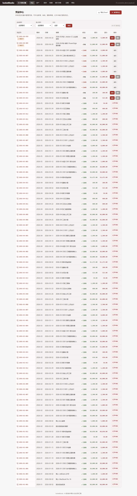
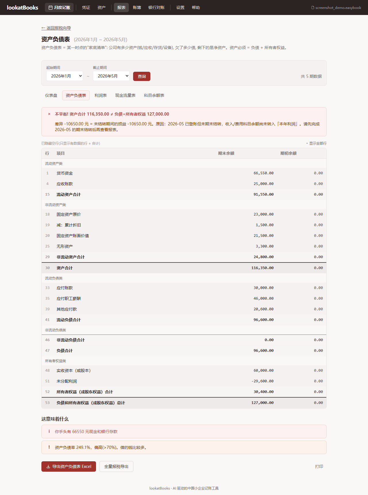

# LookatBooks 看看账

AI 驱动的中国小企业记账工具 —— **内置全功能 Web 记账界面**（建账→记账→报表→报税全流程，无需任何 AI 知识），也可被 coding agent 通过 MCP 调用，或用**独创的离线 LLM 桥接模式**（复制 prompt 到豆包/DeepSeek 等免费大模型网页版，无需 API key）。

> 📜 **本仓库为 lookatBooks 的发布渠道**,含**二进制下载** + **用户文档** + **Issue 跟踪**。源代码闭源,详见 [EULA.md](EULA.md)。
>
> 📥 **下载最新版**:见 [Releases](https://github.com/Kaiji-Z/lookatbooks-app/releases) — Windows `lookatbooks-setup.exe`(安装版)或 `lookatbooks.exe`(绿色版);macOS `lookatbooks-<version>-arm64.dmg`(Apple Silicon)。
>
> 🐛 **遇到 bug / 想要新功能**:[提 Issue](https://github.com/Kaiji-Z/lookatbooks-app/issues/new/choose)。

输入原始单据文件（数电票 XML/OFD/PDF/PNG / 银行流水 Excel / 工资表 Excel），AI 把它们翻译成凭证、登账、期末结转、生成三大报表与可导入电子税务局的报税文件。

> 💰 **记账完全免费** —— 所有记账功能（单据导入 / AI 识别 / 凭证 / 审核登账 / 三大报表 / 月末结转 / 自动备份 / 审计日志）**零成本、无内购、无功能墙、无广告**。
>
> 🎁 **开发期福利**：报税文件导出（`filing` 命令）需激活码。**开发期间任何用户都可以发邮件申请免费激活码**，不收取任何费用。邮件：`lookatmedia@163.com`（申请时请简述使用场景，开发期 100% 通过）。
>
> 📜 License 与免责条款详见 [LICENSE](LICENSE) 与 [EULA.md](EULA.md)。

---

## 📸 界面预览

**月度记账面板** — 5 步向导(上传 → AI 识别 → 体检 → 登账 → 报表)+ 凭证卡片:


**凭证中心** — 全局凭证管理,支持审核 / 红字冲销 / 状态筛选:


**资产负债表** — 三大报表之一,自动试算平衡 + 未结转预警:


---

## 下载与安装

### Windows

从 [Latest Release](https://github.com/Kaiji-Z/lookatbooks-app/releases/latest) 下载:

- **`lookatbooks-setup.exe`**(推荐):双击安装,自动创建桌面快捷方式 + 开始菜单。安装到 `C:\Program Files\lookatBooks\`。
- **`lookatbooks.exe`**(绿色版):单文件,下载即可双击运行,无需安装。

### macOS（Apple Silicon, M1-M4）

下载 `lookatbooks-<version>-arm64.dmg`,拖到 Applications 文件夹。

**首次打开（因未签名,macOS Gatekeeper 会拦截）**:

macOS Sequoia (15.x) 起移除了"右键 → 打开"快捷绕过,需走系统设置:

1. 双击 Applications 里的 lookatbooks → 看到"无法验证开发者"提示 → 点"完成"关闭
2. 打开 **系统设置 → 隐私与安全性** → 滚动找到"已阻止 lookatbooks" → 点"**仍要打开**"
3. 再次双击 lookatbooks → 弹窗确认"打开"

或终端一键绕过（推荐,最快）:
```bash
sudo xattr -cr /Applications/lookatbooks.app
```

> ⚠️ **仅支持 arm64**（Apple Silicon M1-M4, 2020 年后的 Mac）。Intel Mac 暂不支持。
>
> 📁 license 文件存放在 `~/Library/Application Support/lookatbooks/license.key`(macOS 标准用户数据目录,可用 Time Machine 备份)。

### 验证下载完整性（可选）

每个 Release 附带 `SHA256SUMS` 文件,含全部二进制的 sha256 指纹:

```bash
# 下载 SHA256SUMS 与对应的 .exe/.dmg 后, 同目录运行:
sha256sum -c SHA256SUMS    # Linux/macOS/Git Bash
Get-FileHash lookatbooks.exe -Algorithm SHA256   # Windows PowerShell
```

---

## 核心设计原则

- **LLM 不碰数字**:AI 只提议"科目+借贷方向",金额直接取自单据,确定性引擎强制借贷平衡。
- **科目约束防幻觉**:科目代码只能在《小企业会计准则》科目表（60+科目）内,LLM 输出越界即拒绝。
- **人审闭环**:低置信度凭证标"待审",登账后不可改,只能红字冲销。
- **法律姿态**:工具做"起草",财务报表走电子税务局官方【导入】功能;申报提交由实名自然人完成。
- **数据自主**:账套 SQLite 文件本地存储;进程级自动备份 + 完整审计日志,所有写操作可追溯。

---

## 能力（6 个子系统）

| 子系统 | 说明 |
|---|---|
| **核心引擎** | 账套/科目表/凭证 CRUD（强制借贷平衡）/状态机（草稿→待审→已审核→已登账/作废红字冲销）/期末损益结转/试算平衡 |
| **解析** | 数电票 XML/OFD/PDF/图片OCR / 银行流水（多家银行模板+通用兜底）/ 支付宝与微信支付商户资金账单 / 工资表 |
| **报表+报税** | 三大报表（资产负债表净额规则/利润表本期发生额/现金流量直接法）/ 税务计算（增值税/附加税/所得税/个税）/电子税务局 Excel 模板+申报表填表数据+指引/折旧计提 |
| **AI 翻译** | 规则预填（销售/采购/工资/手续费,零 AI）+ LLM 兜底（schema 校验防幻觉:科目越界/借贷不平/金额篡改） |
| **迁移** | 期初余额表导入（借贷平衡校验）+ 科目映射 + 期初结转凭证入账 |
| **入口** | CLI 全命令 / MCP server（给 agent 原生调用）/ Web 全流程交互（建账→记账→审核→登账→报表→报税） |

---

## 使用

### Web UI（推荐 · 全功能 · 无需 AI 知识）

双击桌面快捷方式（Windows）或 Applications 里的 lookatbooks（macOS），或命令行启动：
```bash
lookatbooks ui my.easybook     # 启动原生窗口(默认 pywebview, 单窗口关窗=退出)
lookatbooks ui my.easybook --browser   # 回退系统浏览器(旧行为, 双窗口)
```
窗口里走完 5 步月度向导：**上传单据 → AI 识别+审核 → 体检 → 登账+期末结转 → 出报表/报税**。

> **Web UI 是独立的全功能记账软件**，不依赖 MCP 也不依赖外部 AI API。所有操作（建账 / 单据导入 / 凭证审核 / 登账 / 期末结转 / 资产管理 / 银行对账 / 报表 / 报税导出）都在 Web UI 内完成。
>
> 导航栏「凭证」入口提供全局凭证管理（手动新增 / 审核 / 红字冲销）。

### 🧠 离线 LLM 桥接（独创模式 · 无需 API key）

没有 OpenAI / Claude API key？**照样用 AI 记账。**

lookatBooks 首创「人工 LLM 桥接」模式，把 AI 记账能力从「需要付费 API」降门槛到「任意免费大模型都能用」：

1. 在 Web UI 点「**导出 prompt**」→ 复制到 [豆包](https://doubao.com) / [DeepSeek](https://chat.deepseek.com) / [Kimi](https://kimi.moonshot.cn) 等免费大模型网页版
2. 大模型返回 JSON → 粘回 Web UI「**导入**」
3. 凭证自动生成，和有 API key 的效果一样

> 为什么这么做？很多小企业主 / 代理记账员没有 API key（也不会申请），但都会用网页版大模型聊天。lookatBooks 把「AI 记账」拆成「导出问题 → 大模型回答 → 导入答案」三步，让免费大模型也能当记账 AI 用。

### CLI（进阶,脚本/批量）

```bash
# 建账(交互式询问加密偏好)
lookatbooks init my.easybook --company-name "我的公司" \
    --tax-id 91110000XXXXXXXXXX --taxpayer-type small_scale --start-period 2026-06

# 导入单据(数电票 XML 需 --tax-id 判定进销项方向)
lookatbooks import my.easybook bank_2026-06.xlsx --period 2026-06
lookatbooks import my.easybook invoice.xml --period 2026-06 --tax-id 91110000XXXXXXXXXX

# AI 记账(生成凭证草稿) → 审核 → 登账 → 期末结转
lookatbooks bookkeep my.easybook --period 2026-06
lookatbooks approve my.easybook --period 2026-06 --all
lookatbooks post my.easybook --period 2026-06
lookatbooks close my.easybook --period 2026-06

# 出报表 / 报税文件
lookatbooks report my.easybook balance-sheet --period 2026-06
lookatbooks filing my.easybook --period 2026-06 --quarterly-sales 50000 --output-dir ./output
# 报税文件导出(filing): 需激活码, 开发期可邮件申请免费拿(lookatmedia@163.com)
lookatbooks activate --code <激活码>      # 激活报税导出
lookatbooks license-status                # 查激活状态
```

完整命令参考见 `docs/usage/cli-reference.md`(30 个命令, 按场景分组),或运行 `lookatbooks`(无参数)查看内置帮助。

> CLI 定位:会计师/IT 做**批量操作 / 修账恢复 / 无头脚本**用。普通用户走 Web UI, agent 走 MCP。

### MCP（给你的 AI 助手用 · 第三种入口）

如果你用 Claude Code / Cursor / VS Code / Codex 等 coding agent，可以让 agent 通过 MCP 直接调用记账功能（54 个工具，覆盖建账到报税全流程）。

注册后对 agent 说:"用 lookatbooks 帮我把 2026-06 的银行流水记成账,看看资产负债表"。

📖 **完整使用指南**:[docs/usage/使用指南.md](docs/usage/使用指南.md)

---

## 数据安全

- **建账加密选择**:`lookatbooks init` 省略 `--encrypted/--no-encrypted` 时 TTY 弹 confirm 询问用户加密偏好(非 TTY 回退明文,向后兼容脚本/CI); 加密保护 parties 表的身份证号/银行账号等 PII 不明文落盘, 但密码忘了=账套永久丢失; 用环境变量 `LOOKATBOOKS_DB_KEY` 或 `--passphrase` 提供密钥。`lookatbooks encrypt` 命令可随时启用加密。
- **自动备份**:每次启动 VoucherEngine（每个进程首次）自动快照账套到 `<book>.backups/`,含 WAL checkpoint + PRAGMA integrity_check 验证,LRU 保留最近 30 个。
- **审计日志**:所有写操作（创建/审核/登账/红字冲销/编辑/删除/期末结转/反结账）记录到 `<book>.audit/YYYY-MM-DD.log`,TSV 格式人类可读。
- **失败安全**:审计写失败只警告不阻塞业务;备份完整性失败立即删除坏备份。

lookatBooks 设计为**单机单用户**本地应用（`lookatbooks ui` 启动 localhost 服务）。如需远程访问,请通过 SSH 隧道或 VPN,不要直接暴露端口到公网。

---

## 技术栈

Python 3.11+ · SQLite（单文件账套）· pydantic · openpyxl · defusedxml（XML 实体扩展防护）· Typer(CLI) · FastAPI+Jinja2(Web) · MCP python sdk · Decimal（全链路无浮点）

---

## 法律姿态

lookatBooks 是**记账辅助工具**, 不是代理记账服务, 不是注册会计师服务:

| ✅ 工具做 | ❌ 工具不做 |
|---|---|
| 单据整理 + 凭证生成 | 申报提交(用户自己导入电子税务局) |
| 出三大报表 + 税额计算 | 签字担责 |
| 生成可导入税务局的 Excel | 税务筹划/避税建议 |

工具记的账, 最终报税时**仍需实名自然人核对并提交**。详细免责条款见 [EULA.md](EULA.md)。

---

## 反馈与社区

- 🐛 **Bug / 功能请求**:[提 Issue](https://github.com/Kaiji-Z/lookatbooks-app/issues/new/choose)
- 💬 **使用问题**:同样走 Issue,选"使用咨询"模板
- 📧 **商务合作 / 媒体**:见 EULA.md 联系方式

> 📖 **开放文档**:[PRODUCT.md](PRODUCT.md) / [docs/](docs/) 采用 CC BY-SA 4.0, 欢迎引用与改编。
